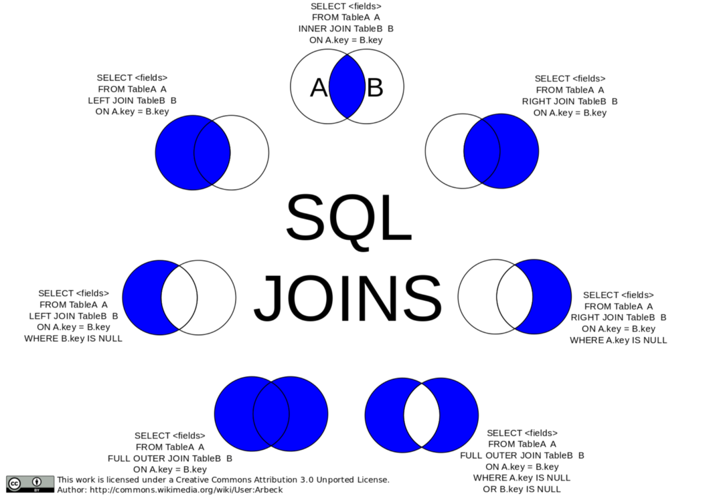

# Advance SQL Queries

ในส่วนนี้เราจะมาลองฝึก Query ข้อมูลจากหลาย ๆ ตารางกัน

ให้เราไป Copy คำสั่งจาก [ที่นี่](https://github.com/napatwongchr/intro-to-database/blob/main/src/blog-apps-mock.sql) มาวางใน pgAdmin 4 query tool แล้วกด play เราจะได้ตาราง และข้อมูลในตาราง

ซึ่งตารางของเรามีทั้งหมด 3 ตาราง แต่ละตารางมี schema ตามนี้

```sql
CREATE TABLE users (
  user_id INTEGER PRIMARY KEY GENERATED ALWAYS AS IDENTITY,
  username VARCHAR ( 25 ) UNIQUE NOT NULL,
  email VARCHAR ( 50 ) UNIQUE NOT NULL,
  firstname VARCHAR ( 100 ) NOT NULL,
  lastname VARCHAR ( 100 ) NOT NULL,
  created_on TIMESTAMP NOT NULL
);
```

ตาราง users ไม่มีอะไรแปลกใหม่ schema เป็นรูปแบบเดิมเลย

```sql
CREATE TABLE posts (
  post_id INTEGER PRIMARY KEY GENERATED ALWAYS AS IDENTITY,
  user_id INT REFERENCES users(user_id) ON DELETE CASCADE,
  content TEXT NOT NULL,
  created_on TIMESTAMP NOT NULL,
  updated_on TIMESTAMP NOT NULL
);
```

ในส่วนตาราง posts จะมีสิ่งที่พิเศษขึ้นมาหน่อย

- เราจะต้องรู้ว่า post นี้ถูกสร้างโดย users คนไหน เราจะต้องสร้าง column user_id เอาไว้ ซึ่ง user_id จะเป็น reference กลับไปหาข้อมูลที่ตาราง users ที่ column user_id เราเรียก column นี้ว่า **"Foreign Key"** 🌟

- ON DELETE CASCADE หมายความว่า ถ้า user นั้น ๆ ถูกลบ เราจะลบ records ของ posts ที่มี user_id นั้น ๆ อยู่ด้วยทั้งหมด

```sql
CREATE TABLE comments (
  comment_id INTEGER PRIMARY KEY GENERATED ALWAYS AS IDENTITY,
  post_id INT REFERENCES posts(post_id) ON DELETE CASCADE,
  user_id INT REFERENCES users(user_id) ON DELETE CASCADE,
  comment TEXT NOT NULL,
  created_on TIMESTAMP NOT NULL,
  updated_on TIMESTAMP NOT NULL
);
```

ในส่วนตาราง comments

- comment นั้นจะต้องมี foreign key post_id และ user_id เพื่อให้สามารถที่จะบอกได้ว่า comment นี้เป็นของ users คนไหน และเป็นของ post ไหน

- ถ้า user_id หรือ post_id ถูกลบ comment ที่ผูกกับ user_id หรือ post_id นั้นๆ ก็จะถูกลบไปด้วย

<br><hr><br>

## INNER JOIN

🧑‍💻 **โจทย์ของเราคือ เราอยากเห็นข้อมูล posts ที่มี email, firstname, และ lastname ของผู้เขียน post**

โจทย์บอกว่าต้องการข้อมูล posts แน่นอนว่าเราจะต้อง query ข้อมูลจากตาราง posts แน่ ๆ

แต่โจทย์ของเราต้องการข้อมูล email, firstname, และ lastname ของผู้เขียน post นั้น ๆ ดังนั้นเราต้องการข้อมูลจากอีกตาราง ซึ่งคือตาราง users

เนื่องจากตาราง posts และตาราง users มี relation ต่อกันให้สังเกตตาราง posts จะมี column ที่บอกว่า post นี้ของ user คนไหนด้วย user_id ดังนั้นเราจะทำการใช้ประโยชน์จาก user_id นี้นำไปหาข้อมูล user ที่ตาราง users ด้วยวิธีการ **JOIN**

เราจะทำการ JOIN ข้อมูลตาราง users เข้ามาในตาราง posts

```sql
SELECT posts.post_id, LEFT(posts.content, 20) AS post_content, users.email, users.user_id
FROM posts
INNER JOIN users
ON posts.user_id = users.user_id;
```

🌟 **การ JOIN มีหลายรูปแบบซึ่ง INNER JOIN เป็นรูปแบบที่ใช้เยอะที่สุด**

<br><hr><br>

## JOIN STRATEGIES



<br><hr><br>

## LEFT JOIN

🧑‍💻 **โจทย์ของเราคือ** ถ้าเราอยากเห็น posts ที่ไม่ระบุคนสร้าง post ด้วยเราจะทำยังไง ?​

เนื่องจาก INNER JOIN มันจะเอาข้อมูลของทั้ง 2 ตารางที่มี user_id ตรงกัน join เข้าด้วยกัน ถ้า post ไหนไม่มี user_id จะหายไปเลย ถ้าเราอยากได้ post ที่ไม่มี user_id เราจะใช้ **LEFT JOIN**

```sql
SELECT posts.post_id, LEFT(posts.content, 20) AS post_content, users.email, users.user_id
FROM posts
LEFT JOIN users
ON posts.user_id = users.user_id;
```

<br><hr><br>

## RIGHT JOIN

🧑‍💻 **โจทย์ของเราคือ** ถ้าเราอยากเห็น users ที่ไม่ได้สร้าง posts เลย

ในเคสนี้เราจะใช้ **RIGHT JOIN**

```sql
SELECT posts.post_id, LEFT(posts.content, 20) AS post_content, users.email, users.user_id
FROM posts
RIGHT JOIN users
ON posts.user_id = users.user_id;
```

<br><hr><br>

## FULL OUTER JOIN

🧑‍💻 **โจทย์ของเราคือ** ถ้าเราอยากเห็น users ที่ไม่ได้สร้าง posts ด้วย และ posts ที่ไม่ระบุคนสร้างด้วย

ในเคสนี้เราจะใช้ **FULL OUTER JOIN**

```sql
SELECT posts.post_id, LEFT(posts.content, 20) AS post_content, users.email, users.user_id
FROM posts
FULL OUTER JOIN users
ON posts.user_id = users.user_id;
```

<br><hr><br>

## SUB QUERIES

เราสามารถเขียน query statement ลงไปใน query ได้ (queryception 😯)

```sql
SELECT comment_id, user_id, LEFT(comment, 20) AS post_comment
FROM comments
WHERE user_id = (SELECT user_id FROM users WHERE firstname = 'Elton');
```

<br><hr><br>

## GROUP BY

🧑‍💻 **โจทย์ของเราคือ** ถ้าเราอยากเห็นจำนวน comments ทั้งหมดของแต่ละ posts จากมากไปน้อย

GROUP BY จะทำการ GROUP post_id ที่ซ้ำ ๆ กันใน แต่ละ comments เข้าด้วยกัน จากนั้นเราใช้ COUNT(\*) ในการนับจำนวน post ที่ซ้ำกัน

```sql
SELECT posts.post_id, COUNT(*) as comment_count
FROM comments
INNER JOIN posts
ON comments.post_id = posts.post_id
GROUP BY posts.post_id
ORDER BY comment_count DESC;
```

<br><hr><br>

## Exercises 🏅

ให้ลบ tables ทั้งหมดที่มีอยู่ใน database เดิมจากนั้นให้ copy ของทุกอย่างที่อยู่ในไฟล์ `src/ecommerce-apps-mock.sql` ไปแปะใน postgres เพื่อ setup tables และ data ใหม่

**จากนั้นให้ลองเขียน query ตามโจทย์**

### Orders Problems

1. อยากรู้จำนวน order ของ customer ที่ชื่อ 'Maia' ในช่วง '2020-05-01' ถึง '2020-10-01'
2. อยากได้ข้อมูล 5 order ล่าสุดของ พร้อมสถานะของ order ของ customer ที่ชื่อ 'Maia'
3. อยากได้ข้อมูล 5 orders ล่าสุดของ customer ที่ชื่อ 'Maia' ที่มี status เป็น 'pending'
4. อยากได้ข้อมูล 5 orders ล่าสุดของ customer ที่ชื่อ 'Maia' ที่มี status เป็น 'paid'

### Products Problems

1. อยากได้ข้อมูลสิ้นค้าขายดีที่สุด 10 อันดับแรก
2. อยากได้จำนวนสินค้าทั้งหมดในแต่ละหมวดหมู่ เรียงจากมากไปน้อย
3. อยากได้จำนวนยอดขายของสินค้าที่มีชื่อว่า 'ipsum'
4. อยากได้จำนวนสินค้าใน stock ของสินค้าที่มีชื่อว่า 'ipsum'
5. อยากได้ข้อมูลสินค้าที่มีราคาตั้งแต่ 100 - 2000 บาท เรียงจากถูกสุดไปแพงที่สุด

### Customer Problems

1. อยากได้ข้อมูลที่อยู่ของ customer ที่ชื่อว่า 'Ifeoma'
