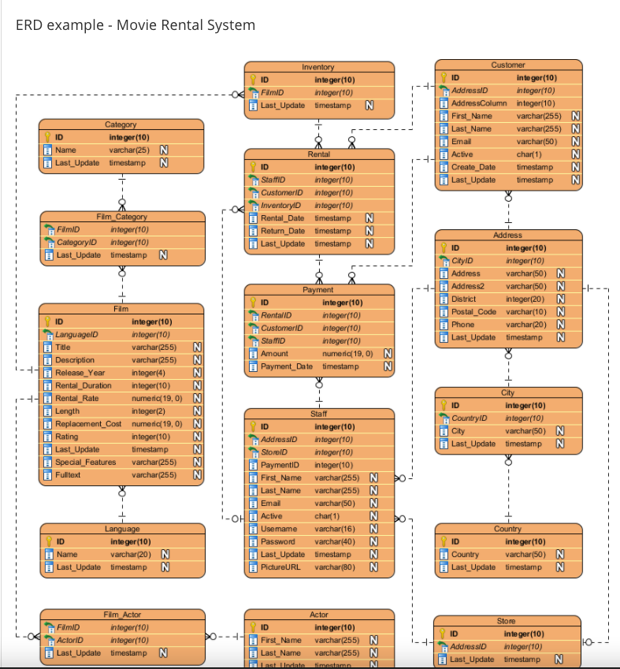
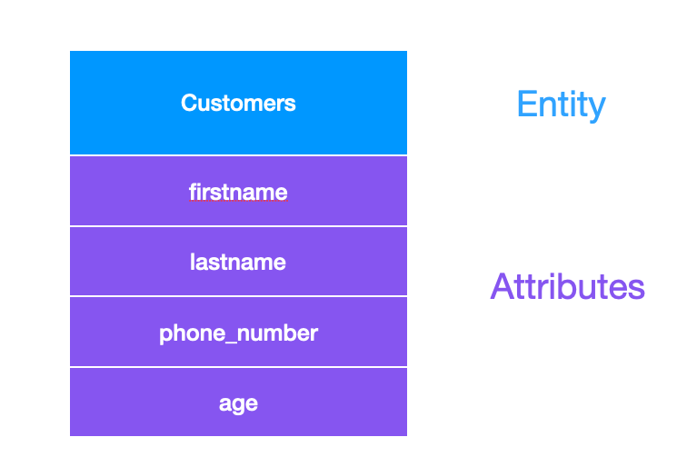

# Entity Relationship Diagram (ERD)

จากที่เราฝึกการ Query ข้อมูลในระบบ เราจะเห็นได้ว่า ถ้า Software มีข้อมูลที่ซับซ้อน มันก็จะยิ่งยากต่อการทำความเข้าใจ เราจะมีเครื่องมือช่วยที่เรียกว่า **Entity Relationship Diagram (ERD)**

ERD คือ **แผนภาพ**ที่แสดงถึงความสัมพันธ์ของข้อมูลต่าง ๆ ที่ใช้ในการออกแบบ Database

## ตัวอย่าง ERD

 

Reference: [Visual paradigm](https://www.visual-paradigm.com/guide/data-modeling/what-is-entity-relationship-diagram/#:~:text=Entity%20Relationship%20Diagram%2C%20also%20known,inter%2Drelationships%20among%20these%20entities.) \_

 
 

## ERD Notation

**Entity** - คือ **สิ่งต่าง** ๆ เช่น Orders, Customers, Products, Addresses เป็นต้น

**Attribute** - คือ Properties หรือ **คุณลักษณะของ** Entity นั้น ๆ

## Relationship

แต่ละ Entity จะมี **Relationship** ต่อกัน

Relationship แบ่งออกได้ประมาณนี้

- **One To One** คือ Entity ที่มีความสัมพันธ์แบบหนึ่งต่อหนึ่ง เช่น 1 User มีได้ 1 User Profile

- **One To Many** คือ Entity ที่มีความสัมพันธ์แบบหนึ่งต่อกลุ่ม เช่น 1 Order มีได้หลาย Product Items

- **Many To Many** คือ Entity ที่มีความสัมพันธ์แบบกลุ่มต่อกลุ่ม เช่น 1 Students มีได้หลาย Courses 1 Course ก็มีได้หลาย Students เช่นเดียวกัน

 
 

## Exercises 🏅

- ออกแบบ Database ของ Application Ecommerce (Lazada) ด้วย ERD
- ออกแบบ Database ของ Application Project กลุ่ม

 
 
