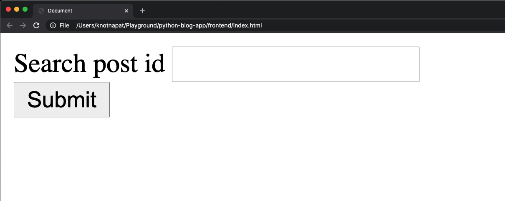

# SQL Injection

SQL Injection เป็นการที่ผู้ใช้งานเว็บของเรา (ผู้ไม่ประสงค์ดี 🦹🏽‍♂️) สามารถที่จะส่ง SQL Code ผ่านทาง Input จากหน้าเว็บของเรา เข้ามาจัดการ Database เราได้

เรามี Code หน้าเว็บที่สามารถ Search Post เพื่อดึงข้อมูล Post นั้น ๆ ออกมาได้



Code ส่วนนี้คือตัวอย่างที่เรียกใช้ API ดึงข้อมูล Post

```html
<script>
  let submitButton = document.getElementById("submit-button");
  let searchPost = document.getElementById("search-post");
  let resultBox = document.getElementById("result-box");

  async function handleSubmitClick() {
    const res = await fetch(
      "http://127.0.0.1:8000/posts/" + encodeURIComponent(searchPost.value)
    );

    const data = await res.json();

    resultBox.innerText = JSON.stringify(data);
  }

  submitButton.addEventListener("click", handleSubmitClick);
</script>
```

Code views ฝั่ง Server เราเขียนไว้แบบนี้

```python
def single_post_detail(request, post_id):
  if request.method == "GET":
    try:
      with connections['default'].cursor() as cursor:
        cursor.execute(f"SELECT * FROM posts_post WHERE id = {post_id}")

        columns = [col[0] for col in cursor.description]

        data = [
          dict(zip(columns, row))
          for row in cursor.fetchall()
        ]
```

⚠️ ⚠️ ⚠️ ⚠️ เราจะสังเกตได้ว่าเราฝัง Parameter post_id เข้าไปใน Query string ตรง ๆ โดยไม่ใช้ Parameterize query เลย ซึ่งตัว post_id เป็นสิ่งที่เรารับมาจาก Client หรือตัวหน้าเว็บของเรา ซึ่งเป็นสิ่งที่**อันตรายมากกกกกกกกกกกกกกกกกกกกกกกกกกกกกกกกกกกกกกกกกกกกกกกกกกกก** อย่าหาทำ ⚠️ ⚠️ ⚠️ ⚠️

จุดนี้แหล่ะเป็นช่องโหว่ของ Web application ของเรา สมมุติว่า user พิมพ์ `2; SELECT * FROM posts --` เข้ามาใน input แล้วเราลองมาดูผลลัพธ์กัน เราจะเห็นได้ว่าข้อมูล post ทั้งหมดถูกดึงออกมา 😱
